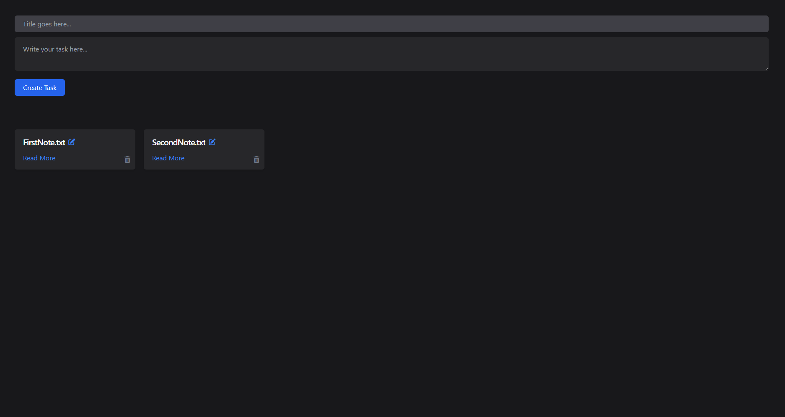
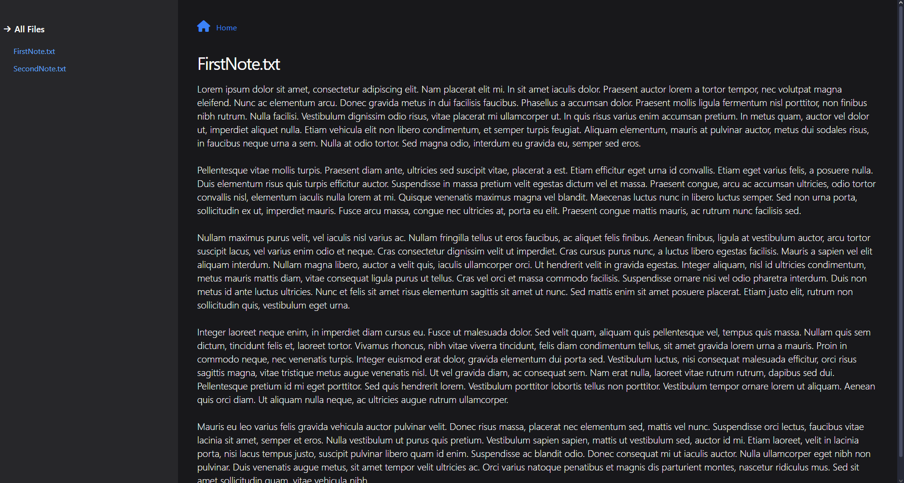
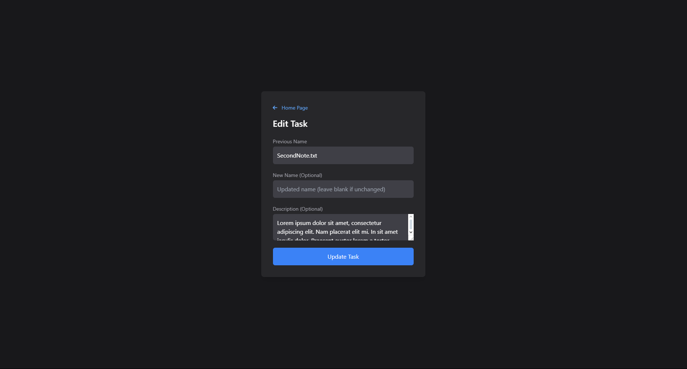

# Note Management Application

This is a simple note management web application built using Node.js, Express, and EJS. It allows users to create, edit, and delete notes, where each notes is represented by a text file. Each note has a name and an optional description. Users can rename notes or update their descriptions.

## Features

- View a list of notes (files) on the home page
- View the content of each note (file) by clicking on it
- Edit note name and/or description
- Create new notes
- Delete notes

## Tech Stack

- **Node.js**: JavaScript runtime for building the backend server
- **Express.js**: Web framework for Node.js
- **EJS**: Embedded JavaScript templates for rendering HTML
- **Tailwind CSS**: Utility-first CSS framework for styling the application

## Setup Instructions

### Prerequisites

- Install [Node.js](https://nodejs.org/) (including `npm`) on your machine.

### 1. Clone the Repository

```bash
git clone https://github.com/Greek-prince/Notepad.git
cd notepad
```

### 2. Install Dependencies

Run the following command to install the required dependencies:

```bash
npm install
```

### 3. Create the files Directory

Create a files directory where all notes (text files) will be stored. Each file represents a note.

```bash
mkdir files
```

### 4. Start the Server

Run the following command to start the server:

```bash
npm start
```

The application will be available at [Here](http://localhost:3000).

## Routes

- GET /: Displays a list of all notes (files).
- GET /files/:filename: Displays the content of a note file.
- GET /edit/:filename: Displays the edit form for renaming or editing a note.
- POST /edit: Handles the renaming and description update for a note.
- POST /create: Creates a new note.
- POST /delete: Deletes a note.

## File Structure

```php
├── files/              # Directory where note files are stored
├── node_modules/       # Directory where project dependencies are installed
├── views/              # EJS templates for rendering HTML
│   ├── index.ejs       # Main page showing the list of notes
│   ├── show.ejs        # Note detail page
│   └── edit.ejs        # Edit note page
├── index.js            # Express application code (entry point)
├── package.json        # Project dependencies and scripts
└── package-lock.json   # Lock file for the exact versions of dependencies
```

## Usage

### 1. Create a New Note

To create a new note, fill in the note's title and description on the home page and submit the form. The note will be saved as a .txt file in the files directory.

### 2. View a Note

Click on a note name from the note list to view the content of the Note.

### 3. Edit a Note

Click on the "Edit" button next to a note. You can edit the note's name or its description. If you only want to change one of them, leave the other field blank.

### 4. Delete a Note

To delete a note, use the "Delete" button next to the note name.

## Screenshots







## License

This project is licensed under the GPL-3.0 license - see the [LICENSE](LICENSE) file for details.

## Acknowledgements

- [Node.js](https://nodejs.org/en)
- [Express.js](https://expressjs.com)
- [EJS](https://ejs.co/index.html)
- [Tailwind CSS](https://tailwindcss.com)
